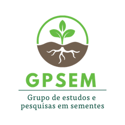

<div align="center">

 

# 🌱 Contador de Sementes (SeedCounter)

**Contagem, classificação e morfometria de sementes — direto no navegador, sem enviar dados para a nuvem.**

[](https://seedcounter.vercel.app)
[](https://seedcounter-teste.vercel.app)
[](https://vitejs.dev)
[](#)
[](LICENSE)

[**▶ Abrir o app**](https://seedcounter.vercel.app) · [**🧪 Versão de teste**](https://seedcounter-teste.vercel.app) · [Site do projeto](https://enricristo.github.io/seedcounter/) · [Como citar](#-como-citar)

</div>

---

Ferramenta desenvolvida no **GPEOrq / GPSEM — Laboratório de Sementes e Tecido Vegetal da Unoeste**, para contagem e análise de viabilidade de sementes — incluindo sementes de orquídea, em escala milimétrica (0,2 a 2,0 mm). Todo o processamento acontece no navegador: **nenhum dado sai do seu computador**.

## ✨ Funcionalidades

### Aquisição
- **Captura por câmera** — lupa e estereomicroscópio no computador (com seleção de dispositivo) ou câmera de celular/tablet.
- **Importação de imagens** — scanner de mesa, arquivos avulsos ou em lote.

### Calibração espacial
Quatro métodos, para que toda medida tenha significado físico:
- **DPI do scanner** (padrão do laboratório: *HP Scanjet G2710* a 3600 DPI)
- **Objeto de referência** — régua, marcação na placa ou o diâmetro da própria placa, medido com dois cliques
- **Micrômetro de platina** — para lupa e microscópio
- **µm/px manual**

Réguas nas bordas do canvas exibem as unidades reais (mm/µm) e acompanham o zoom.

### Contagem e classificação
- **Ferramentas de edição** estilo editor gráfico: marcar viável/inviável, borracha com raio ajustável, arrastar para reposicionar, clique para inverter a classe.
- **Atalhos**: `V` viável · `I` inviável · `X` inverter · `E` borracha · `H` mover · `Alt` borracha temporária · `[ ]` tamanho da borracha.
- **Detecção por IA** *(experimental)* — modelo **YOLOv8m-seg** treinado no dataset do laboratório (mAP50 de 0,918), executado no próprio navegador via ONNX Runtime Web, com recorte em janelas para imagens de alta resolução.
- **Detecção assistida** *(experimental)* — visão computacional clássica (limiar de Otsu + componentes conexos + separação por transformada de distância), sem necessidade de modelo treinado.

### Análise
- **Morfometria** — comprimento, largura e área de cada semente, obtidos das máscaras de segmentação por análise de componentes principais (PCA), convertidos para µm/mm pela calibração.
- **Estatística** — taxa de germinação, intervalo de confiança de Wilson, curvas de germinação, ANOVA e testes de médias.
- **Modo longitudinal** — acompanhamento de experimentos ao longo do tempo (T0, T14, T30…).

### Exportação
CSV, JSON, imagem anotada e PDF — além de **dataset no formato YOLO**, permitindo que cada contagem manual alimente o treinamento de novos modelos.

## 🚀 Usar

| Versão | Endereço | Para quem |
| --- | --- | --- |
| **Estável** | https://seedcounter.vercel.app | Uso em pesquisa |
| **Teste (beta)** | https://seedcounter-teste.vercel.app | Recursos novos, em validação |

É um PWA: pode ser instalado como aplicativo e funciona **offline** após o primeiro acesso.

## 🧭 Como usar

1. Carregue a imagem da placa (arquivo ou câmera).
2. **Calibre a escala** — sem isso, as medidas saem apenas em pixels.
3. Marque as sementes (manualmente ou com auxílio da detecção).
4. Revise: arraste, inverta a classe ou apague o que estiver errado.
5. **Exporte** os resultados.

> ⚠️ Os recursos de detecção automática são **auxiliares**. A conferência do pesquisador é sempre necessária antes de usar os dados em pesquisa.

## 💻 Rodar localmente

Requisitos: **Node.js 22+** e npm (ou apenas Docker).

```bash
git clone https://github.com/enricristo/seedcounter.git
cd seedcounter
npm install
cp .env.example .env      # opcional: GEMINI_API_KEY para funções de IA
npm run dev               # http://localhost:3000
```

Com **Docker** (ambiente padronizado para os computadores do laboratório):

```bash
docker compose --profile dev up            # desenvolvimento, :3000
docker compose --profile prod up --build   # build de produção, :8080
```

Guia completo: [`docs/DOCKER.md`](docs/DOCKER.md).

### Modelo de IA (opcional)

O modelo não é versionado por padrão. Para habilitar a detecção por IA, exporte o modelo treinado para ONNX e salve em `public/models/seeds-yolov8m-seg.onnx`:

```python
from ultralytics import YOLO
YOLO('best.pt').export(format='onnx', imgsz=960, opset=12, simplify=True)
```

> Arquivos acima de 100 MiB são rejeitados pelo GitHub. Use a versão quantizada (int8, ~28 MB) ou fp16 (~55 MB). Modelos com prefixo `_` em `public/models/` são ignorados pelo git.

## 🗂️ Estrutura

```
seedcounter/
├─ src/
│  ├─ components/       # UI (canvas, barra de ferramentas, réguas, layout)
│  ├─ features/         # módulos: câmera, calibração, detecção, IA, estatística…
│  ├─ hooks/            # estado (marcações, ferramentas, zoom, sessões)
│  ├─ context/          # feature flags
│  └─ lib/              # detecção, YOLO/ONNX, calibração, PCA, exportadores
├─ public/models/       # modelo ONNX (não versionado se > 100 MiB)
├─ docs/                # documentação e site do projeto (GitHub Pages)
└─ Dockerfile(.dev)
```

### Feature flags

Recursos novos entram desativados por padrão e podem ser ligados no **painel de Funcionalidades** (ícone ✨ no cabeçalho). As preferências ficam no navegador de cada usuário — o que permite publicar recursos experimentais sem afetar quem usa o app em pesquisa.

## 🔒 Privacidade

- Os dados de contagem **nunca saem do navegador** (IndexedDB).
- A inferência de IA roda **localmente**, sem enviar imagens para servidores.
- A `GEMINI_API_KEY`, se configurada, é embutida no bundle do cliente — restrinja-a por domínio no Google AI Studio. Veja [`SECURITY.md`](SECURITY.md).

> **Atenção ao trocar de endereço:** o IndexedDB é isolado por domínio. Ao migrar de um endereço para outro, exporte o histórico em JSON antes e reimporte depois.

## 🛠️ Tecnologias

Vite · React 19 · TypeScript · Tailwind CSS · PWA (Workbox) · Dexie (IndexedDB) · ONNX Runtime Web · YOLOv8-seg · Recharts · jsPDF

## 👥 Autores e equipe

- **Desenvolvimento:** Enrico S. Ambrosio — Matemático, graduando em Agronomia · [enrico.ambrosio@unesp.br](mailto:enrico.ambrosio@unesp.br)
- **Orientação:** Prof. Dr. Nelson Barbosa Machado Neto
- **Aplicação em pesquisa e validação:** Mayara de Oliveira Vidotto Figueiredo (doutoranda)
- **Coorientação científica:** Profa. Dra. Ceci Castilho Custódio

Grupos: [@gpeorq](https://www.instagram.com/gpeorq) · [@gpsem_2000](https://www.instagram.com/gpsem_2000/) — Universidade do Oeste Paulista (Unoeste)

## 🤝 Contribuindo

Veja [`CONTRIBUTING.md`](CONTRIBUTING.md) para o fluxo de branches (`feature/*` → `docs-upgrade` → `main`) e as boas práticas do projeto.

## 📖 Como citar

> AMBROSIO, E. S.; FIGUEIREDO, M. O. V.; MACHADO NETO, N. B. *Contador de Sementes (SeedCounter): ferramenta client-side para contagem, classificação e morfometria de sementes*. GPEOrq/GPSEM — Laboratório de Sementes e Tecido Vegetal, Universidade do Oeste Paulista (Unoeste), 2026. Disponível em: https://seedcounter.vercel.app

## 📄 Licença

Distribuído sob a licença **MIT** — veja [`LICENSE`](LICENSE).

---

<div align="center">
Feito com 🌱 para o GPEOrq e o GPSEM · Unoeste
</div>
