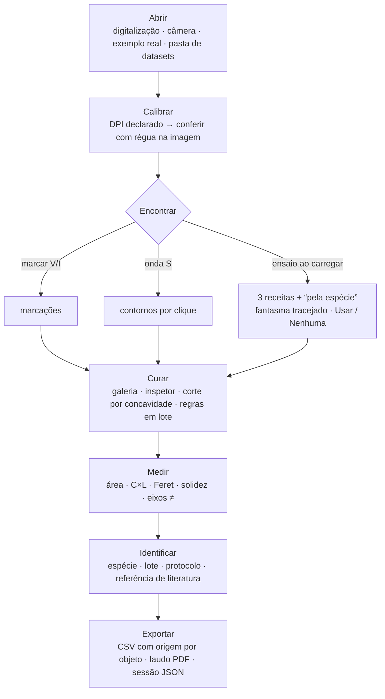
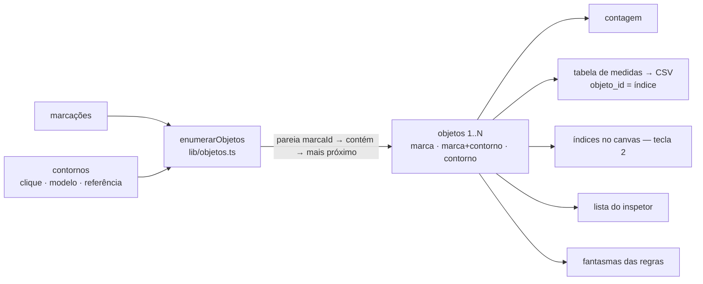
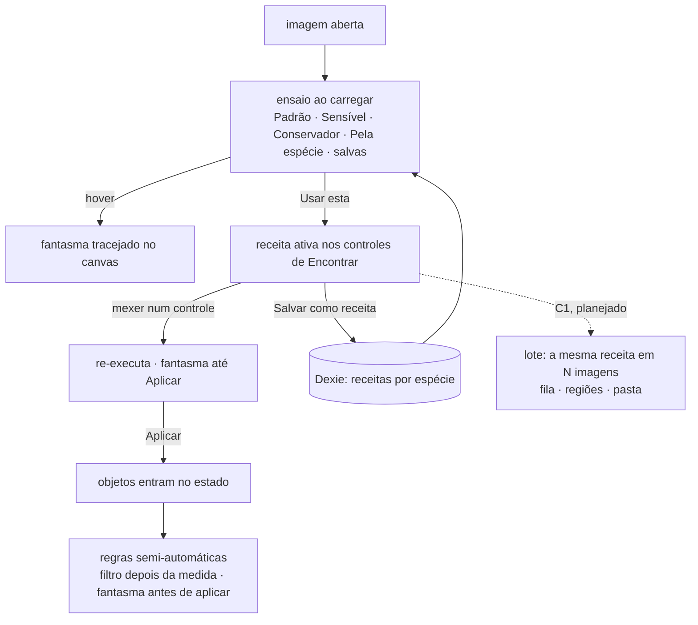
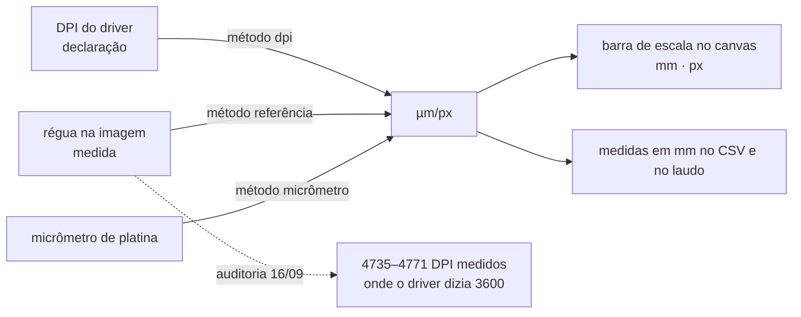
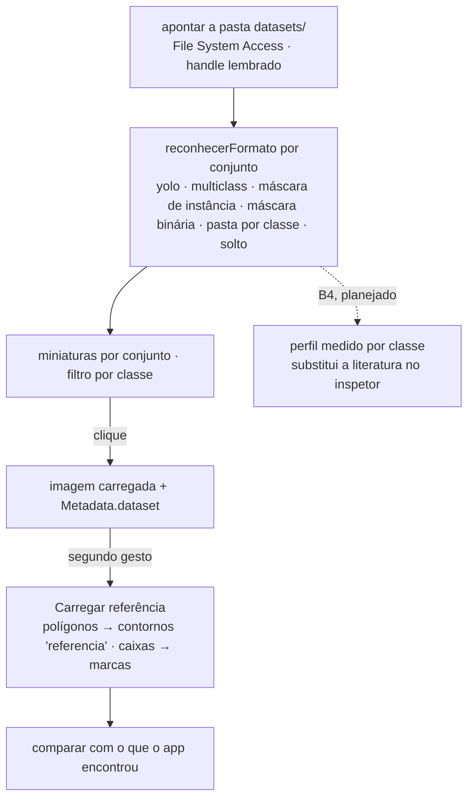
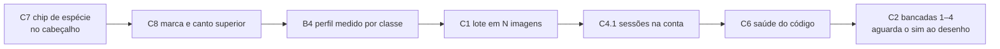
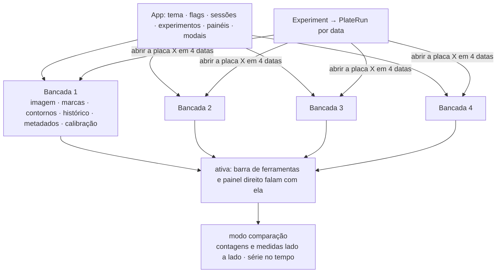

# Fluxos e dinâmicas do SeedCounter

Diagramas do que o app faz e de como as partes se ligam. A versão curta, em sete passos, está dentro do app (Instruções de uso → Fluxo, em diagrama ou lista). Aqui estão as dinâmicas que não cabem na lateral: como os dados se alinham, como o ensaio vira receita e lote, como o explorador de datasets entra, e o que ainda é plano.

Fonte de verdade dos passos: `src/features/ajuda/atalhos.ts` (`FLUXO_DE_TRABALHO`).

---

## 1. O caminho de uma amostra

## 2. Uma lista, um número — a governança dos dados

Antes, a contagem incluía contornos do modelo mas a tabela de medidas só percorria marcações: semente detectada sem marca era contada e não medida. Hoje tudo lê a mesma enumeração.

Regras que não caem: contorno de clique é a forma da marcação (não conta duas vezes); contorno oculto não conta (esconder = rejeitar); contorno de referência conta e vai marcado no CSV.

## 3. Receita: do ensaio ao lote

Limites de tamanho: `× mediana` (transfere entre imagens), `mm²` (com calibração) ou `px²` (referência) — tudo vira px² antes de rodar.

## 4. A escala: o que é declaração e o que é medida

Consequência registrada: o padrão do laboratório passou a 4800 DPI; toda medida em mm feita antes com 3600 estava 32% maior que o real. O DPI do driver é promessa; a régua é a conferência.

## 5. Datasets: abrir a pasta e trabalhar

## 6. O que ainda é plano (fila em `docs/superpowers/specs/2026-09-15-fila-bancadas-lote-eixos.md`)

## 7. Bancadas (C2), o desenho que espera aprovação

