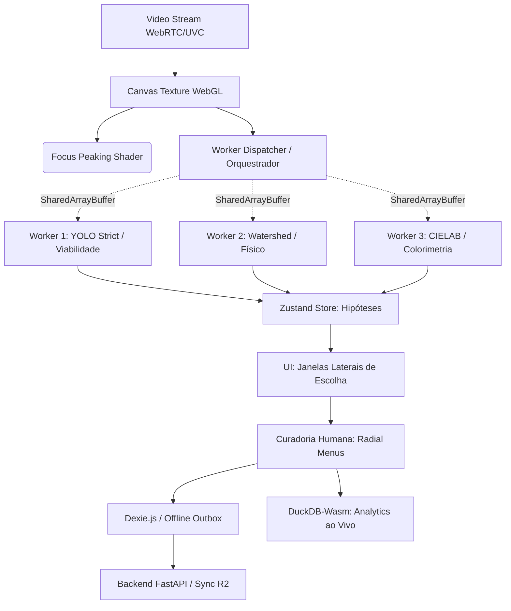

# Especificação Arquitetural: SeedCounter Scale-Up (Lab Copilot)
**Data:** 2026-09-13
**Status:** Proposto
**Autores:** Equipe de Arquitetura SeedCounter

---

## 1. Contexto e Motivação
A transição do SeedCounter de uma prova-de-conceito (segmentação YOLO básica) para o **Padrão-Ouro Agronômico Comercial** requer a integração de rigor analítico e usabilidade extrema na bancada. As demandas identificadas (Identificação ao Vivo com Múltiplos Pipelines, Taxonomia Hierárquica, Integração UVC) necessitam de mudanças estruturais (Architectural Path) no Frontend (React/WebWorkers) e no fluxo de Dados (DuckDB/IndexedDB).

Esta especificação detalha o *design*, os algoritmos, a gestão de estado e os modos de falha previstos para construir essa plataforma sem sacrificar a performance (alvo: 60 FPS contínuos).

---

## 2. Arquitetura de Componentes e Fluxo de Dados

O sistema migrará de uma renderização síncrona monobloco para uma **Arquitetura de Atores baseada em Web Workers**, separando I/O de Câmera, Inferência e Renderização.



---

## 3. Detalhamento Técnico das Features Core

### 3.1. Oráculo Visual (Execução Especulativa de Múltiplos Pipelines)
O sistema deve sugerir abordagens antes do usuário pedir.
* **Mecanismo:** Ao extrair o frame estabilizado via `ImageCapture`, o bitmap é gravado em um `SharedArrayBuffer` para evitar cópias caras de memória e enviado ao *Worker Pool*.
* **O Orquestrador (Zustand State):**
  * `state.hypotheses`: Array contendo os retornos paralelos (`id`, `pipeline_name`, `masks[]`, `summary_stats`).
  * A UI assina este estado e renderiza um carrossel lateral (Thumbnails). Ao passar o mouse (Hover), a máscara da hipótese é projetada com 50% de opacidade no canvas principal (Preview Instantâneo).
* **Pipelines Paralelos:**
  1. *YOLO-ONNX Base:* Inferência padrão com IOU de 0.45.
  2. *YOLO-ONNX Estrito:* IOU de 0.8, focando em evitar Falsos Positivos.
  3. *Watershed Tradicional:* Fallback físico OpenCV.js baseado em H-minima (ideal para sementes minúsculas como *Urochloa* grudadas, onde o YOLO se funde).

### 3.2. Taxonomia Hierárquica e Curadoria (Radial Menus)
O banco de dados precisa suportar ontologias complexas (Semente Pura -> Inviável -> Dano Mecânico -> Tegumento Rachado).
* **Banco de Dados (DuckDB/SQLAlchemy):** O campo `category` em `annotations` deixa de ser `VARCHAR` (ex: 'viable') e passa a ser uma representação de caminho (Path L-Tree) ou `JSONB` array: `["semente_pura", "inviavel", "mecanico", "tegumento"]`.
* **Cálculo Angular do Menu Radial:** Quando o analista segura o botão direito do mouse no canvas sobre a semente de ID `X`, o menu surge.
  * O ângulo do movimento do mouse $\theta$ é calculado via `Math.atan2(dy, dx)`.
  * Se $-45^\circ \le \theta < 45^\circ$ (Direita) $\rightarrow$ Submenu Inseto.
  * Se $45^\circ \le \theta < 135^\circ$ (Cima) $\rightarrow$ Submenu Fungo.
  * O UX registra a anotação na soltura do clique (MouseUp), validando a anotação em $< 300\text{ms}$.

### 3.3. Engenharia Óptica (Integração UVC e WebGL)
* **Controle UVC Nativo:** Usaremos a API de *MediaTrackConstraints* para travar a câmera.
  ```typescript
  // Exemplo de payload para travar auto-exposição e fixar temperatura de cor:
  await track.applyConstraints({
    advanced: [{
      whiteBalanceMode: 'manual',
      colorTemperature: 6500, // D65 Illuminant
      exposureMode: 'manual',
      exposureTime: 120 // em microsegundos
    }]
  });
  ```
* **Focus Peaking via Shader WebGL:** Para não bloquear a *Main Thread* da UI do React, o vídeo da lupa passa por um Canvas off-screen rodando um WebGL Fragment Shader implementando o Filtro Sobel ou Filtro Laplaciano. Somente os gradientes de alta intensidade são convertidos no canal Alpha e coloridos de verde. 

### 3.4. Morfometria: Rotating Calipers (Feret)
Para mapear dimensões para crivos de peneiras agronômicas, extraímos o **Diâmetro de Feret** $L_{min}$ e $L_{max}$.
* A máscara gerada pelo ONNX é vetorizada (marching squares) obtendo o contorno bruto.
* Aplica-se o **Convex Hull** (ex: *Monotone Chain* $O(N \log N)$).
* O algoritmo *Rotating Calipers* gira simulando um paquímetro $O(N)$ em relação ao contorno convexo. Isso embasa a regra física de peneiramento exigida no MAPA.

---

## 4. Análise de Riscos, Modos de Falha e Mitigações

| Risco / Modo de Falha | Gatilho | Impacto | Mitigação / Guideline |
| :--- | :--- | :--- | :--- |
| **Out-of-Memory (OOM) no Navegador** | Instanciar 4 Web Workers rodando modelos ONNX simultaneamente em tablets (iPad/Android). | *Crash* da aba / Perda de sessão de curadoria. | **Mitigação:** Verificar `navigator.deviceMemory` e `hardwareConcurrency`. Fazer degradação graciosa (Graceful Degradation): em dispositivos limitados, rodar as hipóteses em série ou apenas a primária. |
| **Suporte Incompleto a UVC constraints** | Firefox e Safari frequentemente não expõem sliders de `exposureMode` na MediaDevices API. | O laboratório não consegue travar a iluminação contra reflexos. | **Mitigação:** Exibir alerta suave ("Seu navegador bloqueia controles avançados de câmera"). Fornecer fallback de bracketing HDR (3 fotos em níveis lógicos via software) para Safari. |
| **Gargalo no DuckDB-Wasm (Cold Start)** | Carregar o binário `.wasm` de 25MB pela primeira vez atrasa a renderização do Dashboard analítico. | UX "travada" ao trocar da aba Canvas para a aba Estatísticas. | **Mitigação:** Inicializar e popular o worker do DuckDB de forma assíncrona durante a tela de abertura (Splash Screen) enquanto o operador liga a câmera. |
| **Sobrecarga Cognitiva (Cluttered UI)** | Mostrar retículos de Petri, foco peaking, e janelas de hipóteses tudo ao mesmo tempo. | Analista se distrai e comete erros no boletim. | **Mitigação:** Princípio de *Progressive Disclosure*. Modo Padrão é limpo. Teclas de atalho mantidas pressionadas (Ex: Segurar 'Alt') mostram o overlay técnico temporariamente. |
| **Taxonomia Divergente da Câmera (Drift)** | O analista corrige 500 sementes localmente. A taxonomia não sincroniza ou sincroniza em esquema conflitante com o banco backend SQLAlchemy. | Corrupção de relatórios RAS. | **Mitigação:** Versionamento Estrutural. Cada anotação carrega o UUID do Schema Taxonômico (ex: `schema: "ras-v2.1"`). O Backend deve suportar evolução de schema para L-Trees. |

---

## 5. Diretrizes de Implementação e QA (Guidelines)

1. **Separação Obrigatória State vs. Render:** O componente React `MarkingCanvas.tsx` NÃO pode calcular $L_{min}$ no *render cycle*. Ele apenas renderiza coordenadas recebidas da *Zustand Store*, que foram populadas assincronamente por Web Workers.
2. **Test Driven Development (TDD) Morfométrico:** 
   - *Teste Unitário obrigatório:* Injetar um círculo perfeito sintético no calculador Feret. $L_{min}$ e $L_{max}$ devem ser rigorosamente iguais.
   - *Teste Unitário obrigatório:* Injetar um retângulo sintético 10x20. $L_{min} \approx 10, L_{max} \approx 22.36$ (hipotenusa).
3. **Analytics Tracking (Telemetry):** Cada uso das Janelas de Hipóteses (qual lente o usuário escolheu) e cada clique no Menu Radial deve disparar um evento para o endpoint `/api/v1/telemetry/`. Isso diz ao Data Science qual pipeline de *Active Learning* treinar no próximo mês.

---

## 6. Próximos Passos (Transição para Plano de Implementação)
- [ ] O usuário valida esta Especificação (Spec).
- [ ] Criar o plano de migração atômico (`plans/2026-09-13-scaleup-fase1.md`) focando inicialmente apenas no **Worker de Execução Especulativa** e refatoração do Store (desacoplando o modelo atual).
- [ ] Definir interface gráfica do Menu Radial (Figma ou código de teste `Spike`).
